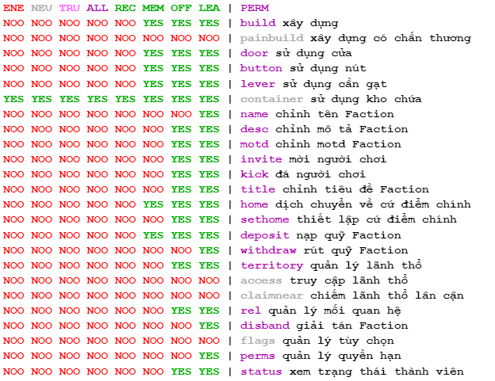

# Hệ thống Faction

## Phe phái (Faction)

Faction được thành lập nhằm mục tiêu cùng xây dựng, phát triển với mục đích trở thành thế lực hùng mạnh nhất. Một Faction có tối đa 10 thành viên.

Có 3 Faction được thiết lập sẵn bởi hệ thống bao gồm:  
**Wilderness**: faction mặc định, dành cho những người chơi không thuộc bất cứ phe phái nào.  
**SafeZone**: faction này được tạo ra nhằm mục đích thiết lập những vùng đất không thể giao tranh.  
**WarZone**: faction này được tạo ra nhằm mục đích thiết lập những vùng đất có thể giao tranh.

Lệnh dùng để tạo faction: `/f create <tên faction>`

## Vai trò (Role)

Một Faction có 4 vai trò khác nhau, mỗi vai trò đều góp phần tạo nên một Faction có tổ chức.
- **Thủ lĩnh (Leader)**: vai trò cao nhất, sở hữu tất cả quyền hạn giúp điều hành một Faction. Mỗi Faction chỉ có duy nhất một thủ lĩnh.
- **Phó thủ lĩnh (Officer)**: vai trò có nhiều quyền hạn nhất sau Thủ lĩnh, giúp hỗ trợ và điều hành một Faction. Mỗi Faction có thể có nhiều phó thủ lĩnh.
- **Thành viên (Member)**: vai trò có đủ quyền hạn để đóng góp, xây dựng và phát triển Faction. Mỗi Faction có thể có nhiều thành viên.
- **Lính mới (Recruit)**: vai trò mặc định khi gia nhập và có ít quyền hạn nhất trong Faction trước khi trở thành thành viên chính thức. Mỗi Faction có thể có nhiều lính mới.

## Chỉ số Power

Mỗi người chơi sẽ có 1 chỉ số gọi là Power. Power có được bằng cách online mỗi tiếng để tích lũy 2 power và mất 2 power mỗi khi chết (một số vùng sẽ không mất power khi chết).

*Mỗi người chơi có tối đa 50 power và tối thiểu -10 power.*

Power còn được dùng trong việc chiếm đất (đọc mục sau để hiểu rõ hơn). Khi power âm (dưới mức 0), người chơi sẽ không thể rời khỏi faction hiện tại.

## Lãnh thổ & Chiếm đất

### Lãnh thổ (Territory)

Lãnh thổ là vùng đất đã được chiếm bởi 1 Faction nào đó.

Có 3 vùng đất tương ứng với 3 phe phái đã được thiết lập sẵn bởi hệ thống.  
**Vùng hoang dã (Wilderness)**: vùng đất chưa có sự tuyên bố chủ quyền của bất cứ Faction nào khác gọi là vùng hoang dã.  
**Vùng an toàn (SafeZone)**: vùng đất thuộc về hệ thống, không thể chiếm đất hay giao tranh. Đây là nơi mọi người có được sự an toàn tuyệt đối khi an tọa.  
**Vùng chiến trường (WarZone)**: vùng đất thuộc về hệ thống, nơi đây không thể chiếm đất nhưng có thể giao tranh giữa những người chơi và phe phái khác.  

### Chiếm đất (Claim)

Chiếm đất là hành động tuyên bố chủ quyền lãnh thổ của Faction nào đó lên một mảnh đất.

*Chỉ có thành viên thuộc Faction đã chiếm mảnh đất đó mới có thể xây dựng hay làm bất cứ việc gì tác động lên nó. Mỗi mảnh đất chiếm được đều phải trả phí.*

Một mảnh đất được tính theo chunk (16x16x256), xem chunk bằng cách nhấp tổ hợp F3 + G. Mỗi mảnh đất chiếm được cần 1 Power Faction đó (Sau khi chiếm, lượng power không mất đi).

*Power Faction được tính bằng tổng power mà các thành viên trong Faction đó hiện có.*

Điều kiện để chiếm đất:  
- Đất thuộc Wilderness
- Đất không thuộc SafeZone, WarZone hoặc các Faction khác được tạo bởi hệ thống.
- Đất thuộc các Faction không thuộc hệ thống nhưng có Power Faction nhỏ hơn Tổng số lượng đất đã chiếm
- Power Faction lớn hơn Tổng số lượng đất đã chiếm
- Thành viên có quyền quản lý lãnh thổ (territory)
- Faction đủ ngân sách để trả phí

Nói cách khác, để chiếm được đất của Faction của người chơi khác, thành viên cần có quyền hạn, lượng tiền nhất định trong ngân sách Faction và lượng Power Faction lớn hơn Power của mảnh đất đó để tiến hành chiếm.

!> **Lưu ý**: Khi Power Faction nhỏ hơn Tổng số lượng đất đã chiếm, Faction khác có thể chiếm và sử dụng mảnh đất đó.

## Mối quan hệ (Relationship)

Nhằm phân biệt đâu là bạn, đâu là thù, Faction có 4 mối quan hệ giúp phân biệt tình trạng giữa các Faction với nhau.  
**Trung lập (Neutral)**: quan hệ mặc định giữa các Faction, chưa rõ là đồng minh hay thù địch.   
**Đồng minh (Ally)**: quan hệ đồng minh, được thiết lập để chia sẻ lợi ích, cùng nhau phát triển và tạo dựng mối quan hệ tốt đẹp giữa các Faction với nhau.  
**Thù địch (Enemy)**: quan hệ thù địch, được thiết lập do mâu thuẫn, xung đột lợi ích, lãnh thổ giữa các Faction với nhau.  
**Trung lập (Neutral)**: quan hệ đình chiến, đã từng là thù địch nhưng hiện tại đang ngừng chiến, đây chưa hẳn là kết thúc của quan hệ thù địch nhưng là bước đệm để hướng đến mối quan hệ tốt đẹp hơn.

Xem chi tiết lệnh ở mục ​[Lệnh cần biết](#lệnh-cần-biết-command)

## Quyền hạn (Permission)
​
**ENE** = Enemy - Áp dụng với các Faction quan hệ thù địch.  
**NEU** = Neutral - Áp dụng với các Faction quan hệ trung lập.  
**TRU** = Truce - Áp dụng với các Faction quan hệ đình chiến.  
**ALL** = Ally - Áp dụng với các Faction quan hệ đồng minh.  
**REC** = Recruit - Áp dụng với vai trò lính mới trong Faction.  
**MEM** = Member - Áp dụng với vai trò thành viên trong Faction.  
**OFF** = Officer - Áp dụng với vai trò phó thủ lĩnh trong Faction.  
**LEA** = Leader - Áp dụng với vai trò thủ lĩnh trong Faction.  
**PERM** = Permission - Danh sách các từ khóa quyền hạn để áp dụng.  
**NOO** - Không áp dụng quyền hạn.  
**YES** - Có áp dụng quyền hạn.

Đối với quyền hạn chữ màu tím (VD: build, door, button,....), thủ lĩnh hoặc người chơi có quyền hạn rel có thể chỉnh sửa bằng lệnh.  
Đối với quyền hạn chữ màu xám (VD: painbuild, container,...), thủ lĩnh hoặc người chơi có quyền hạn rel không thể chỉnh sửa bằng lệnh.

**Danh sách quyền hạn mặc định khi thành lập Faction**

Xem chi tiết lệnh ở mục ​[Lệnh cần biết](#lệnh-cần-biết-command)

## Lệnh cần biết (Command)

### Lệnh cơ bản

Câu lệnh | Mô tả
--- | ---
/f list | Xem danh sách toàn bộ các faction.
/f player <người chơi> | Xem thông tin người chơi.
/f f,faction <tên faction, tên thành viên> | Xem thông tin faction.
/f join <tên faction> | Gia nhập vào Faction (Cần có lời mời gia nhập của chủ Faction đó trước tiên).
/f create <tên faction> | Thành lập Faction mới.
/f map | Xem khu vực lãnh thổ lân cận tại vị trí đang đứng.
/f map <on/off> | Bật/tắt chế độ tự động hiển thị khu vực lãnh thổ lân cận.
/f rank <người chơi> | Xem vai trò của người chơi trong Faction.
/f unstuck | Dịch chuyển ra khỏi lãnh thổ faction đang đứng.

### Lệnh dành cho thành viên Faction

Câu lệnh | Mô tả
--- | ---
/f home | Về cứ điểm chính của Faction.
/f leave | Rời khỏi Faction hiện tại.
/f money b,balance | Xem ngân sách Faction.
/f money d,deposit <số tiền> | Đóng góp cho ngân sách Faction hiện tại.
/f money w,withdraw <số tiền> | Rút tiền khỏi ngân sách Faction hiện tại.

### Lệnh quản lý thành viên

Câu lệnh | Mô tả
--- | ---
/f invite list | Xem danh sách các lời mời trước đó của Faction.
/f invite add <người chơi> | Mời người chơi khác gia nhập Faction.
/f invite remove <người chơi> | Xóa lời mời gia nhập Faction trước đó của người chơi.
/f kick <thành viên> | Đá người chơi ra khỏi Faction.
/f title <thành viên> <biệt danh> | Đặt biệt danh cho thành viên.
/f promote <thành viên> | Thăng tiến vai trò cho thành viên.
/f demote <thành viên> | Giáng cấp vai trò của thành viên.

### Lệnh quản lý quan hệ Faction

Câu lệnh | Mô tả
--- | ---
/f relation list | Xem danh sách quan hệ các Faction đã thiết lập.
/f relation wishes | Xem danh sách quan hệ các Faction đang mong muốn được thiết lập.
/f relation set <tên faction> <quan hệ> | Thiết lập quan hệ với Faction khác.
/f neutral <tên faction> | Thiết lập quan hệ trung lập với Faction khác.
/f truce <tên faction> | Thiết lập quan hệ đình chiến với Faction khác.
/f ally <tên faction> | Thiết lập quan hệ đồng minh với Faction khác.
/f enemy <tên faction> | Thiết lập quan hệ thù địch với Faction khác.

### Lệnh quản lý lãnh thổ Faction

Câu lệnh | Mô tả
--- | ---
/f claim o,one | Chiếm ô đất hiện tại.
/f claim a,auto | Bật chế độ chiếm đất tại vị trí hiện tại, có thể di chuyển để chiếm đất ở các vị trí vừa di chuyển.
/f claim f,fill | Chiếm phần đất phía trong còn sót lại.
/f claim s,square | Chiếm đất theo hình vuông.
/f claim c,circle | Chiếm đất theo hình tròn.
/f unclaim o,one | Hủy ô đất ở vị trí đang đứng.
/f unclaim a,auto | Bật chế độ hủy chiếm đất tại vị trí hiện tại, có thể di chuyển để hủy chiếm đất ở các vị trí vừa di chuyển.
/f unclaim f,fill | Hủy chiếm phần đất còn lại tại vị trí đang đứng.
/f unclaim s,square | Hủy chiếm đất theo hình vuông.
/f unclaim c,circle | Hủy chiếm đất theo hình tròn.
/f unclaim all all <tên faction> | Hủy chiếm toàn bộ đất của Faction.

### Lệnh quản lý Faction

Câu lệnh | Mô tả
--- | ---
/f name <tên faction mới> | Đặt tên mới cho Faction.
/f description <mô tả> | Đặt mô tả cho Faction.
/f sethome | Đặt cứ điểm chính cho Faction.
/f unsethome | Hủy cứ điểm chính của Faction.
/f disband | Giải tán Faction.

### Lệnh quản lý quyền hạn

Câu lệnh | Mô tả
--- | ---
/f perm list | Xem danh sách quyền hạn hiện có của Faction.
/f perm show | Xem bảng quyền hạn Faction.
/f perm set <từ khóa quyền hạn> <mối quan hệ/vai trò> | Thiết lập quyền hạn cho Faction.
