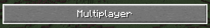
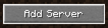
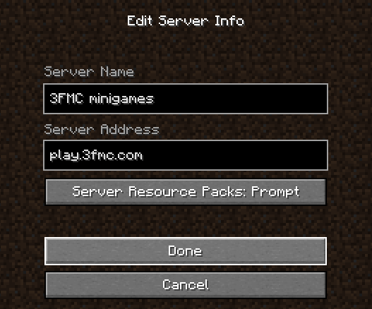
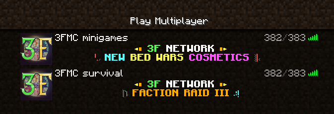

# Tham gia chơi

## Tải game :id=download

Đầu tiên bạn cần tải một **Minecraft Launcher** để khởi động game

- Nếu bạn đã có tài khoản premium thì có thể tải game trên trang chính thức của Mojang: https://www.minecraft.net/en-us/download
- Nếu bạn không có tài khoản premium (hoặc không biết là gì) thì hãy tải Launcher khác
  - Bạn có thể tìm hiểu trên Google
  - Khuyến khích dùng [**TL Legacy**](https://tlaun.ch/) (tải trực tiếp [tại đây](https://tlaun.ch/installer))
- Một số launcher khác có thể cân nhắc thêm
  - [Lunar Client (premium)](https://www.lunarclient.com/)
  - [Salwyrr](https://www.salwyrr.com/)

!> Không khuyến khích dùng **TLauncher** do gây ra lỗi với hệ thống skin và những nghi vấn theo dõi người dùng. Tìm hiểu thêm [tại đây](https://www.reddit.com/r/PiratedGames/comments/nay62e/which_are_the_best_minecraft_cracked_launchers/gxy9rr5/)

## Vào chơi :id=play

3FMC có 2 địa chỉ IP tương ứng với 2 cụm trò chơi
- **Minigames** với những trò chơi mang tính chất giải trí: `play.3fmc.com`
- **Survival** dành cho những bạn muốn sinh tồn và cày cuốc lâu dài: `sv.3fmc.com`

Toàn bộ network hỗ trợ mọi phiên bản từ **1.8** đến **1.18** (Java Edition / PC).  
Tuy nhiên các cụm trò chơi sẽ có những phiên bản được hỗ trợ riêng, hãy để ý nhé!

### Các bước kết nối máy chủ
- Tại màn hình chính khi mở Minecraft, hãy click vào `Multiplayer`

- Trong màn hình Multiplayer, hãy click vào `Add Server`

- Hãy điền tên và địa chỉ IP của server trong màn hình này và bấm `Done`

- Sau khi hoàn tất thì 3FMC sẽ được thêm vào danh sách máy chủ. Khuyến khích thêm cả 2 IP để tiện lợi hơn trong việc chuyển đổi cụm trò chơi. Hãy click vào máy chủ trong danh sách để tham gia chơi ngay!

